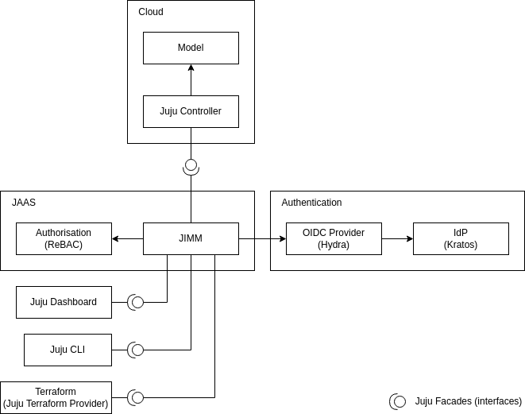

JAAS Overview
=============

What is JAAS?
-------------

To detail what JAAS is, let's look at what JAAS provides:

- **JAAS** provides a single location to manage your Juju infrastructure by using the 
  Dashboard or using the same Juju CLI commands to create a high-level overview of your deployments 
  with the ability to drill into the details when you need it. 

- **JAAS** is  useful for organisations running their own Juju infrastructure 
  giving them a single point of contact for their entire real estate and, in combination
  with the Juju Dashboard, giving them a clear overview of their infrastructure.

- **JAAS** enables site reliability engineers and developers to access models via identities from an external IdP
  and is not limited to local users.

- **JAAS** enables site reliability engineers and developers to manage access control across all of their
  controllers, models, applications and application offers from a single place, as opposed
  to having to go through each Juju controller manually and updating permissions specifically
  for individual local users on each controller.

- As **JAAS** provides a single point of contact for customers entire real estate, automation
  is substantially easier, automation need only perform actions through **JAAS** and not consult
  each controller individually.

- **JAAS** can query across multiple models at once, giving deeper insights into your estate.

JAAS Components
---------------

The diagram below shows an overall picture of JAAS architecture.

.. #
   Note: JAAS diagram is already in a Miro board here:
     https://miro.com/app/board/uXjVKUIUKAc=/

   There is also a backup of the board in this directory (named `jaas-diagram.rtb`)
   which can be used to restore on Miro (in case the original board mentioned above
   was no longer available).

JAAS consists of the following components:

- Juju Intelligent Model Manager (JIMM)
- ReBAC authorisation (OpenFGA)
- Database (PostgreSQL)
- Secure storage (Vault)

JIMM is an API server that implements a number of Juju facades (i.e. endpoints) and behaves as a *Juju Controller*,
which under the hood proxies operations to underlying controllers. This enables
other tools, like the Juju Dashboard or Juju CLI, that communicate with a 
Juju Controller to work seamlessly with JIMM.

For authentication of users or service accounts, JAAS requires an *OIDC Provider*
(Hydra) that handles the standard OAuth2.0 flows including browser flow, device flow,
and client credentials.

For more information on the architecture on JAAS and its scalability, check out our :doc:`architecture <./jaas_architecture>` doc.
