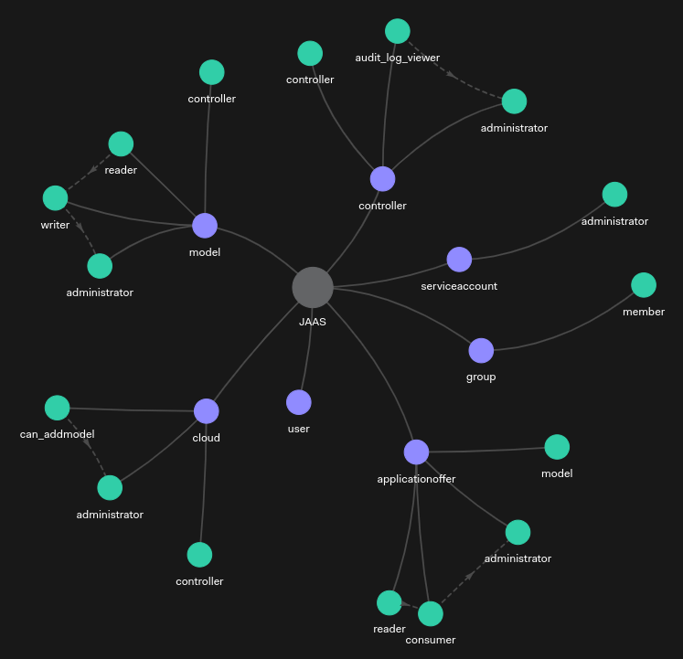

# JAAS: Authorisation Model

JAAS uses a Relationship-Based Access Control (ReBAC) scheme for authorisation purposes. This document illustrates the underlying authorisation model used by JAAS.

```{tip}
For an explanation on Relationship-Based Access Control (ReBAC) check out {doc}`this <../explanation/authorisation>` explanation topic.
```

```{tip}
As a reference on manipulating authorisation data, check out {doc}`this <./authorisation_data>` reference topic.
```

## The model

JAAS authorisation model reshapes the [Juju permission model](https://juju.is/docs/juju/user-permissions) into a ReBAC paradigm. The OpenFGA authorisation model used by JAAS is defined as:

```text

    model
  schema 1.1

    type user

    type role
    relations
        define assignee: [user, user:*, group#member]

    type group
    relations
        define member: [user, user:*, group#member]

    type controller
    relations
        define controller: [controller]
        define administrator: [user, user:*, group#member, role#assignee] or administrator from controller
        define audit_log_viewer: [user, user:*, group#member, role#assignee] or administrator

    type model
    relations
        define controller: [controller]
        define administrator: [user, user:*, group#member, role#assignee] or administrator from controller
        define reader: [user, user:*, group#member, role#assignee] or writer
        define writer: [user, user:*, group#member, role#assignee] or administrator

    type applicationoffer
    relations
        define model: [model]
        define administrator: [user, user:*, group#member, role#assignee] or administrator from model
        define consumer: [user, user:*, group#member, role#assignee] or administrator
        define reader: [user, user:*, group#member, role#assignee] or consumer

    type cloud
    relations
        define controller: [controller]
        define administrator: [user, user:*, group#member, role#assignee] or administrator from controller
        define can_addmodel: [user, user:*, group#member, role#assignee] or administrator

    type serviceaccount
    relations
        define administrator: [user, user:*, group#member, role#assignee]
```

Here is the directed graph illustration of the above model. In this figure, purple and green nodes represent entity types and relations, respectively. The dashed lines show the internal indirect relationships among relations defined on the entity type.



## Valid Relations

Below we break down, by resource type, the relations from the authorisation model. By describing what level of access each relation provides so that you can
determine how much access to provide to users and groups.

Below, only permissions which are assignable to users or groups are described. Relations like `controller` are used internally to indicate
that, for example, a controller admin is also an admin of any models.

You can use the `jimmctl` CLI to manipulate relations as mentioned above or via the [Juju Terraform Provider](https://registry.terraform.io/providers/juju/juju/latest/docs)
using the JAAS specific resources.

```{tip}
Treat service accounts as users when relating them to resources. Only when assigning permissions over a service account are they treated as a different entity.
```

Currently the permission levels are analogous (with slightly different wording) to those built into Juju; view the [Juju permission docs](https://juju.is/docs/juju/user-permissions). For details see {ref}`controller`, {ref}`cloud`, {ref}`model`, {ref}`offer`, {ref}`service-account`, {ref}`role`, {ref}`group`.
