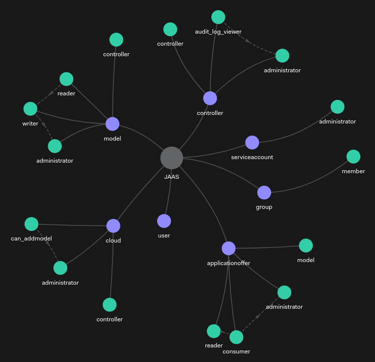

JAAS: Authorisation Model
=========================

JAAS uses a Relationship-Based Access Control (ReBAC) scheme for authorisation purposes. This document illustrates the underlying authorisation model used by JAAS.

.. hint::
    For an explanation on Relationship-Based Access Control (ReBAC) check out :doc:`this <../explanation/authorisation>` explanation topic.

.. hint::
    As a reference on manipulating authorisation data, check out :doc:`this <./authorisation_data>` reference topic.

The model
---------

JAAS authorisation model reshapes the `Juju permission model <https://juju.is/docs/juju/user-permissions>`_ into a ReBAC paradigm. The OpenFGA authorisation model used by JAAS is defined as:

.. code:: text

    model
        schema 1.1

    type applicationoffer
    relations
        define administrator: [user, user:*, group#member] or administrator from model
        define consumer: [user, user:*, group#member] or administrator
        define model: [model]
        define reader: [user, user:*, group#member] or consumer

    type cloud
    relations
        define administrator: [user, user:*, group#member] or administrator from controller
        define can_addmodel: [user, user:*, group#member] or administrator
        define controller: [controller]

    type controller
    relations
        define administrator: [user, user:*, group#member] or administrator from controller
        define audit_log_viewer: [user, user:*, group#member] or administrator
        define controller: [controller]

    type group
    relations
        define member: [user, user:*, group#member]

    type model
    relations
        define administrator: [user, user:*, group#member] or administrator from controller
        define controller: [controller]
        define reader: [user, user:*, group#member] or writer
        define writer: [user, user:*, group#member] or administrator

    type serviceaccount
    relations
        define administrator: [user, user:*, group#member]

    type user

Here is the directed graph illustration of the above model. In this figure, purple and green nodes represent entity types and relations, respectively. The dashed lines show the internal indirect relationships among relations defined on the entity type.

Valid Relations
---------------

Below we break down, by resource type, the relations from the authorisation model. By describing what level of access each relation provides so that you can
determine how much access to provide to users and groups.

Below, only permissions which are assignable to users or groups are described. Relations like `controller` are used internally to indicate
that, for example, a controller admin is also an admin of any models. 

You can use the ``jimmctl`` CLI to manipulate relations as mentioned above or via the `Juju Terraform Provider <https://registry.terraform.io/providers/juju/juju/latest/docs>`_ 
using the JAAS specific resources.

.. hint::
    Treat service accounts as users when relating them to resources. Only when assigning permissions over a service account
    are they treated as a different entity.

Currently the permission levels are analogous (with slightly different wording) to those built into Juju. They are included here as JAAS intends to build finer 
grained access levels in the future. View the `Juju permission docs <https://juju.is/docs/juju/user-permissions>`_.

Application Offer
^^^^^^^^^^^^^^^^^
=============  =========
Relations      Abilities
=============  =========
administrator  You can do anything that it is possible to do at the level of an offer.
consumer       Relate an application to the offer.
reader         View offers during a search with juju find-offers.
=============  =========

Cloud
^^^^^
=============  =========
Relations      Abilities
=============  =========
administrator  You can do anything that it is possible to do at the level of a cloud.
can_addmodel   Add a model. Grant another user model-level permissions.
=============  =========

Controller
^^^^^^^^^^
================     =========
Relations            Abilities
================     =========
administrator        You can do anything that it is possible to do at the level of a controller. This grants permissions to all resources that inherit from controller access.
audit_log_viewer     Allows you to read audit logs.
================     =========

Group
^^^^^
=============  =========
Relations      Abilities
=============  =========
member         Assigns a user/group as a member of the group.
=============  =========

Model
^^^^^
=============  =========
Relations      Abilities
=============  =========
reader         View the content of a model without changing it. Can use any of the read commands.
writer         Deploy and manage applications on the model.
administrator  You can do anything that it is possible to do at the level of a model. This grants permissions to all resources that inherit from model access. 
=============  =========

Service Account
^^^^^^^^^^^^^^^
=============  =========
Relations      Abilities
=============  =========
administrator  You can do anything that it is possible to do at the level of a service account. Used to manage the credentials of a service account.
=============  =========
